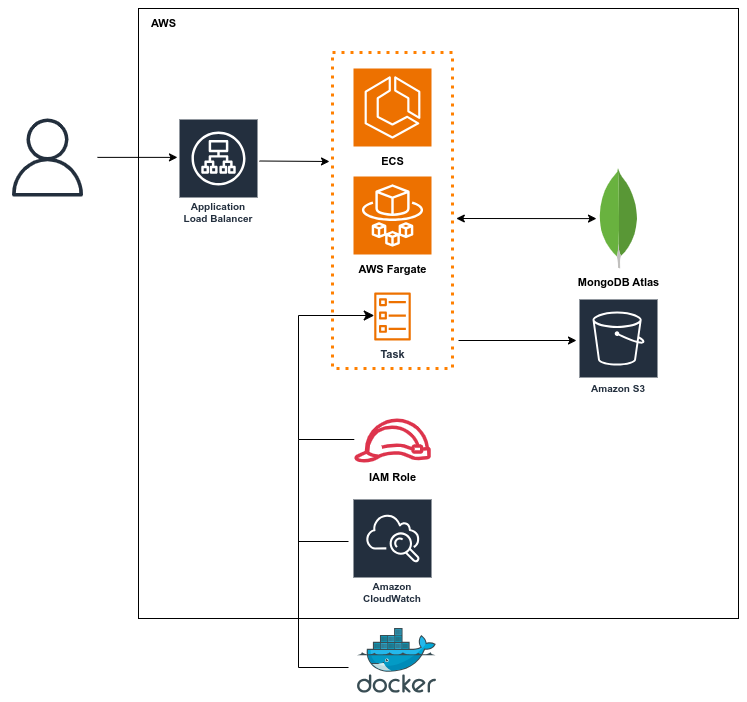

# MLE Take-Home Assignment Starter

## FastAPI ML Service with MongoDB, Docker, and AWS Ready Architecture

This project is a scalable Machine Learning API service built with **FastAPI** and **MongoDB**, containerized using **Docker**, designed for deployment on **AWS ECS (Fargate)**, and ready for CI/CD integration.

It provides:

- **Data ingestion API**: Upload Iris dataset samples into MongoDB.
- **Training API**: Train models (Logistic Regression, SVM, Random Forest) on the stored samples.
- **Prediction API**: Predict species from input features based on the requested trained model.
- Full **Docker** setup and **CI/CD** ready (GitHub Actions + Docker Hub).
- **AWS Architecture diagram** ready.

---
## How to Run
- docker-compose up --build
- docker-compose run --rm test
- docker-compose up -d

- Swagger UI: http://localhost:8000/docs

## Available APIs
| Endpoint         | Method | Description                                | Request Body (if any)    |
|------------------|--------|--------------------------------------------|--------------------------|
| `/data`          | POST   | Add one Iris sample to MongoDB             | Iris sample JSON         |
| `/data/upload`   | POST   | Upload CSV file with multiple iris samples | Multipart Form CSV file |
| `/train`         | POST   | Train a classification model               | Model name (string)      |
| `/predict`       | POST   | Predict species from features              | Iris input JSON (no species) |
| `/data`          | DELETE | Delete the entire data in iris collection  | None          

## CI/CD Pipelines

The deployment process follows these steps:

1. **Code Push**: Developer pushes code changes to GitHub.
2. **CI/CD Pipeline**: 
    - GitHub Actions automatically build the Docker image.
    - Tests are run to verify the app.
    - The Docker image is pushed to Docker Hub.

## AWS Architecture

The application is deployed using a fully managed, serverless AWS architecture:

- **Application Load Balancer (ALB)**: Handles incoming HTTP traffic and routes it to ECS.
- **Amazon ECS (Fargate)**: Runs the containerized FastAPI app. Reference to docker hub image in Task to pull the latest Docker image. Set log drivers to CloudWatch in Task. Set IAM Role for Task to decrease premissions of the user and secure access.
- **MongoDB Atlas**: Database service to insert and get data.
- **Amazon S3**: Stores trained model files (.pkl).
- **Amazon CloudWatch**: Collects application logs and metrics and monitor the app.

### AWS Architecture Diagram

## Author

- **Name**: Kimia Taba